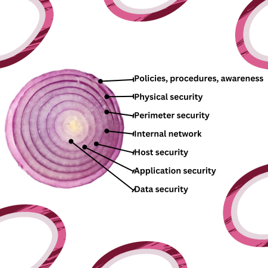
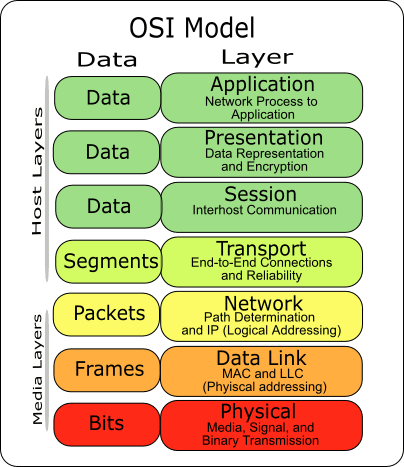

# Principes de base en sécurité #

## La sécurité pour un développeur ##

### Vos responsabilités ###
- Vous assurez de suivre les bonnes pratiques en matière de sécurité.
- Garder continuellement à jour le système d'exploitation, les logiciels et les librairies.
- Considérez la sécurité durant la sélection et la configuration des services.
- Assurez une bonne journalisation des évènements et un suivi constant.
- Bien documenter les systèmes afin d'en faciliter l'administration
- Décommissionner les systèmes qui ne sont plus utilisés.
- Monitorer continuellement et ajuster promptement les accès aux différents systèmes.
### Évolution constante ###
**Le portrait de la sécurité évolue sans cesse** parce que de nouvelles vulnérabilités, techniques d’attaque et logiciels malveillants apparaissent régulièrement. Les technologies elles-mêmes (serveurs, applications, protocoles) changent et introduisent de nouveaux risques.

**Cela exige une veille constante**. Un informaticien se doit de rester informé des mises à jour, correctifs et bonnes pratiques. Sans cette vigilance, une infrastructure sécurisée aujourd’hui peut devenir vulnérable demain.
## Triade CIA ##
La **triade CIA** est un concept central en cybersécurité qui regroupe trois principes fondamentaux :
- **Confidentialité (Confidentiality)** : Une information se doit d'être accessible uniquement qu’aux personnes autorisées
- **Intégrité (Integrity)** : L’information doit être exacte, complète et non altérée.
- **Disponibilité (Availability)** : L’information et les systèmes sont accessibles aux personnes autorisées quand elles en ont besoin.
## Défense en profondeur ##
Le **principe de défense en profondeur** repose sur l’idée qu’on ne doit pas se fier à une seule barrière de sécurité, mais mettre en place **plusieurs couches de protection** qui se complètent.

Si une couche est contournée (ex. mot de passe deviné), une autre prend le relais (ex. authentification multifactorielle, chiffrement, pare-feu).

La pile OSI peut guider les considérations de protections

## Prévention, détection, et correction ##
Un système bien sécurisé se doit d'avoir des mécanismes de prévention, de détection et de correction en place.
- **Prévention** : Mesures mises en place pour **éviter** qu’un incident de sécurité ne se produise (ex. pare-feu, mises à jour, mots de passe forts).
- **Détection** : Mécanismes qui permettent de **repérer** rapidement une attaque en cours (ex. journaux, systèmes de surveillance, alertes). 
- **Correction** : actions entreprises pour **mitiger** les dommages et **rétablir** la situation après un incident (ex. restaurer une sauvegarde, appliquer un correctif, isoler une machine infectée).
## AAA ##
Les **3 A de la sécurité** sont :
- **Authentification** : vérifier l’identité d’un utilisateur.
- **Autorisation** : déterminer ce que l’utilisateur a le droit de faire une fois identifié.
- **Audit** : enregistrer et analyser les actions effectuées, pour assurer le suivi et détecter d’éventuels abus.

